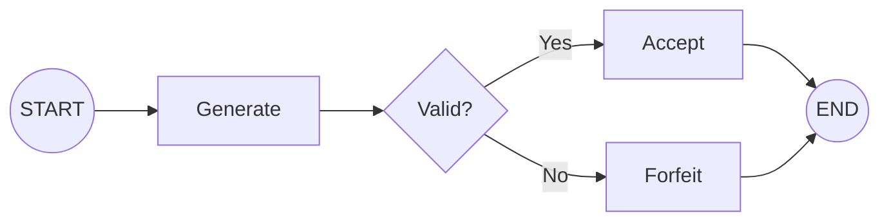
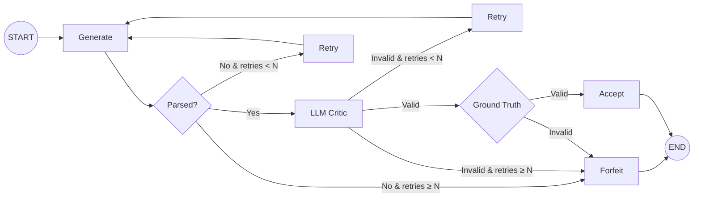
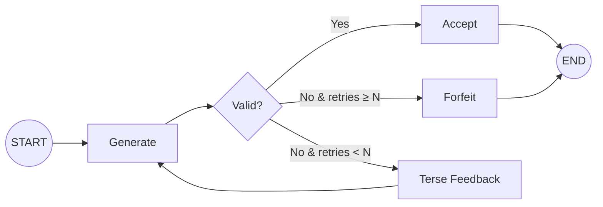
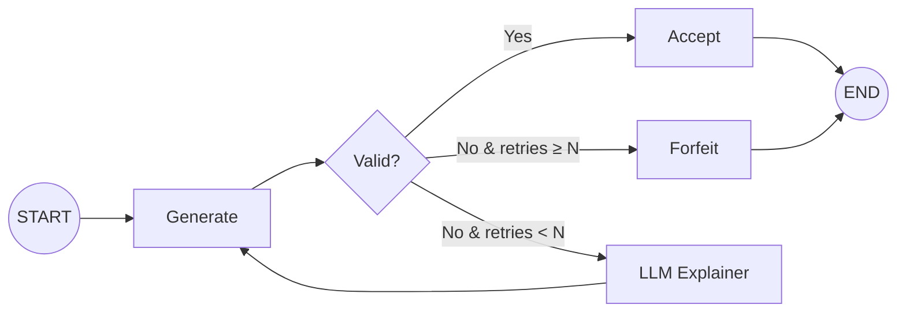
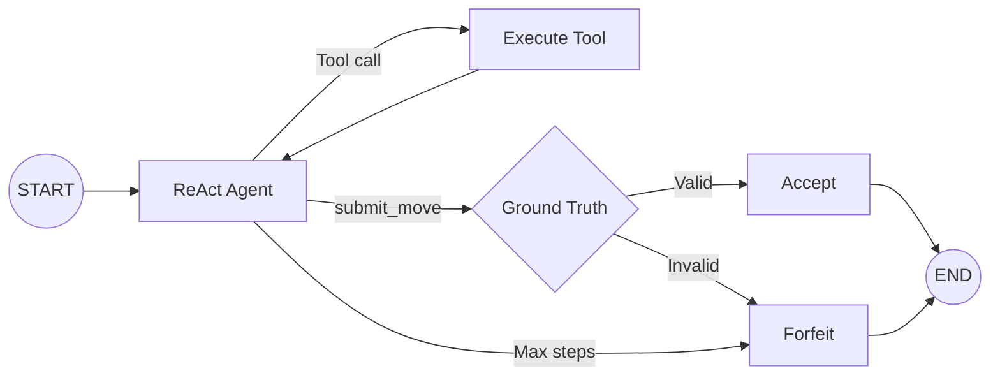

# Condition Graphs

## Overview

Six experimental conditions are implemented as either plain functions (A) or LangGraph `StateGraph` instances (B–F). All share the same `TurnState` contract and use `parse_and_validate` from `base_graph.py`.

For implementation-level node behavior and state mutation details, see `docs/architecture/graph-implementation.md`.

## Condition Summary

| Condition | Architecture | Retries | Validation | LLM Calls (min–max) |
|-----------|-------------|---------|------------|---------------------|
| A | Direct function call (no LangGraph) | 0 | Symbolic | 1 |
| B | LangGraph StateGraph | 0 | Symbolic | 1 |
| C | LangGraph + LLM Critic loop | 3 | LLM Critic → Ground-truth | 2 – 2+2N |
| D | LangGraph + Symbolic loop | 3 | Symbolic + terse feedback | 1 – 1+N |
| E | LangGraph + Symbolic + Explainer loop | 3 | Symbolic + LLM Explainer | 1 – 1+2N |
| F | ReAct loop with tool calling | 0 (uses max_steps=6) | Ground-truth after submission | 1 – M |

## Generation Strategies

All conditions B–E support 3 swappable generation strategies (set via `generation_strategy` in state):

| Strategy | Flow | Extra LLM Calls |
|----------|------|-----------------|
| `generator_only` | LLM → UCI move | 0 |
| `planner_actor` | Strategist LLM → NL plan → Tactician LLM → UCI move | +1 per attempt |
| `router_specialists` | Router LLM → phase → Phase-specialist LLM → UCI move | +1 per attempt |

The validation pipeline is independent of the generation strategy.

## Graph Topologies

### Condition A — Direct Call (No Graph)

```
Prompt → LLM → Parse → Validate → Accept / Forfeit
```

### Condition B — Generator Only



### Condition C — LLM Critic Loop



### Condition D — Symbolic Validator Loop



### Condition E — Symbolic + LLM Explainer Loop



### Condition F — ReAct + Tools



## Entry Points

Each condition exposes a `run_condition_X(...)` function:

```python
from src.graph.condition_a import run_condition_a
from src.graph.condition_b import run_condition_b
from src.graph.condition_c import run_condition_c
from src.graph.condition_d import run_condition_d
from src.graph.condition_e import run_condition_e
from src.graph.condition_f import run_condition_f
```

All accept `fen`, `move_history`, `move_number`, `game_id`, `input_mode`, `generation_strategy` (except F), and `model_config`. All return a completed `TurnState`.
