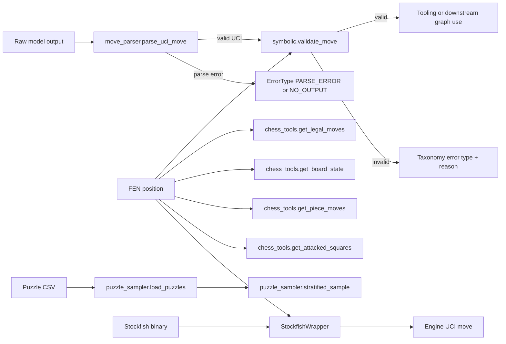

# System Overview

## Implemented Runtime Components

- State contract layer (`src/state.py`)
- Error taxonomy layer (`src/error_taxonomy.py`)
- Validation layer (`src/validators/*`)
- Tooling layer (`src/tools/chess_tools.py`)
- Data preparation layer (`src/data/puzzle_sampler.py`)
- Engine interface layer (`src/engine/stockfish_wrapper.py`)

## Current Data Flow

## Implementation Boundaries

- Modules currently provide deterministic behavior and typed return payloads.
- LangGraph orchestration and multi-condition execution are not implemented yet.
- Analysis and experiment runners are not implemented yet.
