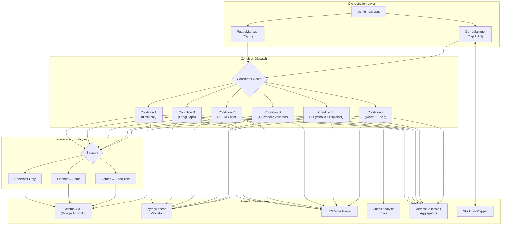
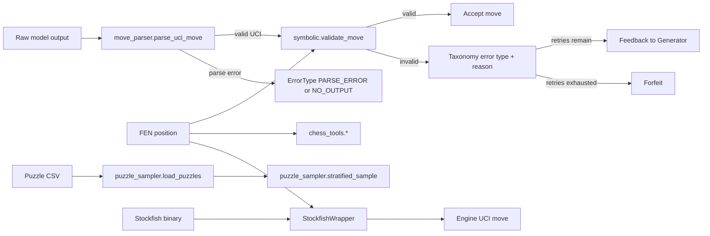

# System Overview

## Implemented Runtime Components

- State contract layer (`src/state.py`)
- Error taxonomy layer (`src/error_taxonomy.py`)
- Configuration layer (`src/config.py`, `src/engine/config_loader.py`)
- LLM client layer (`src/llm/llm_client.py`)
- Agent layer (`src/agents/*`)
- Prompt template layer (`src/prompts/*`)
- Graph layer (`src/graph/*`)
- Validation layer (`src/validators/*`)
- Tooling layer (`src/tools/chess_tools.py`)
- Data preparation layer (`scripts/puzzle_sampler.py`, re-exported by `src/data/__init__.py`)
- Engine interface layer (`src/engine/stockfish_wrapper.py`)
- Orchestration layer (`src/engine/puzzle_manager.py`, `src/engine/game_manager.py`, `src/engine/condition_dispatch.py`, `src/engine/result_store.py`)
- Metrics layer (`src/metrics/*`)

## High-Level Architecture

## Data Flow

## Implementation Boundaries

- Phases 1, 2, 3, and 4 are complete: core infrastructure, all 6 condition graphs, metrics package, and orchestration (managers and configs).
- Analysis/reporting pipelines are not implemented yet.
