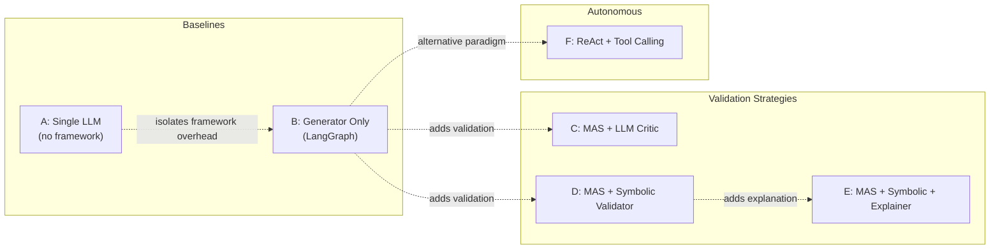
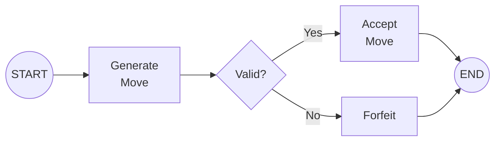
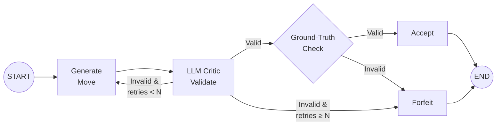
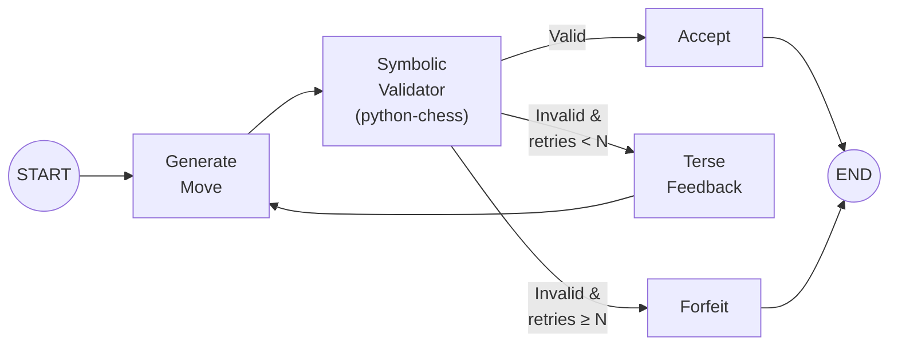
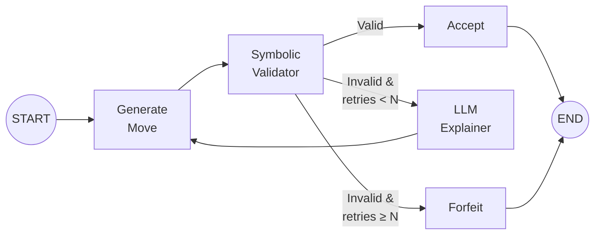
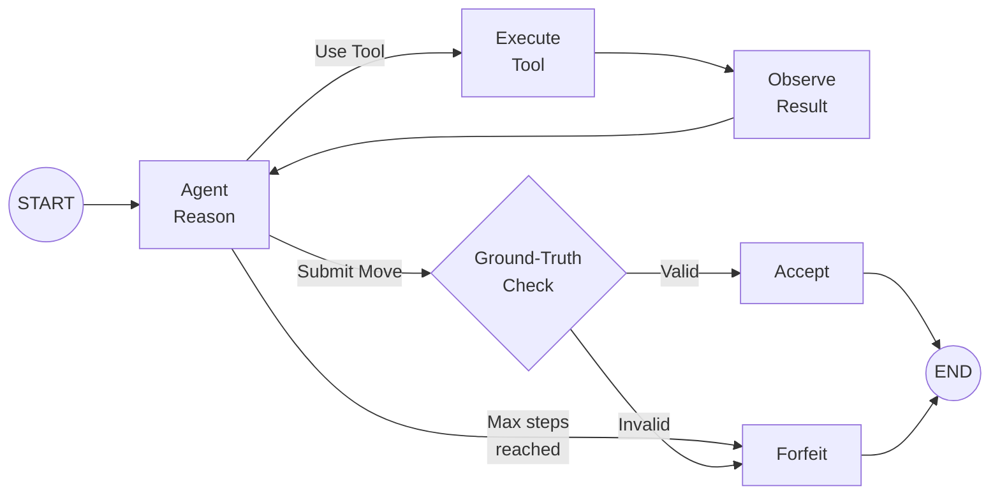
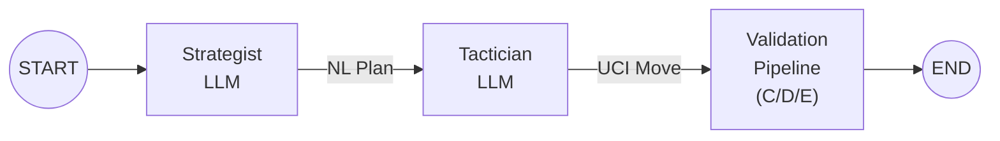
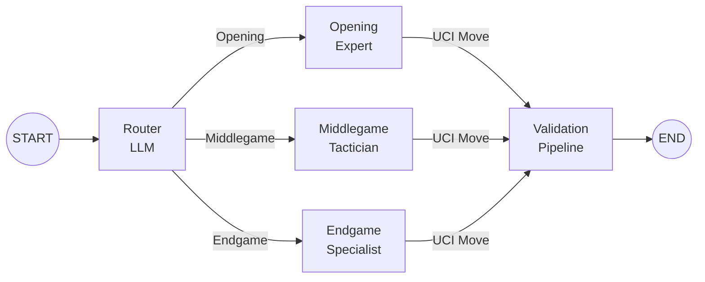

# Maat — Research Plan & System Architecture

## 1. Research Objectives

This project investigates whether explicit architectural structure — role separation, structured validation, and rule enforcement — can reduce rule violations and improve multi-turn consistency in LLM-based chess play.

### Research Questions

| ID | Question | Primary Metrics | Experiments |
|----|----------|-----------------|-------------|
| **RQ1** | Can explicit role separation reduce rule violations? | FIR (Final Invalid Rate), MFIR (Marginal FIR Reduction), GCR, MBF | Exp 1 (all conditions), Exp 2 & 3 (selected conditions) |
| **RQ2** | Does structured validation improve multi-turn consistency? Does embedding full board state (FEN) vs. move-history-only affect error recurrence? | SERR, PCRR, Legality Degradation Curve, ECC, Input Length vs Error Correlation, FTIR-over-time | Exp 2 vs Exp 3 |
| **RQ3** | How should rule enforcement be embedded inside an agentic workflow? | FIR, RSR, MRTC, LCPT, TPT, CAFIR, Critic Confusion Matrix, Error-Type × Condition RSR | Exp 1 (all conditions) |

### Fixed Variables

| Variable | Value |
|----------|-------|
| LLM | Gemma 4 27B via Google AI Studio API |
| Framework | LangGraph (Python) |
| Rule Engine | `python-chess` |
| Move Format | UCI (e.g. `e2e4`, `e7e8q`) |
| Board Format | FEN |
| Opponent (full games) | Stockfish at ELO 800–1000 |

---

## 2. Experimental Conditions

### 2.1 Condition Overview



### 2.2 Condition Details

#### Condition A — Single LLM Baseline

- **Architecture**: Direct API call, no LangGraph.
- **Flow**: Prompt → LLM → parse UCI → validate with `python-chess` → if illegal, **forfeit**.
- **Purpose**: Establishes the raw LLM capability floor.

#### Condition B — Generator Only (LangGraph)

- **Architecture**: Single-node LangGraph graph wrapping the same LLM call.
- **Flow**: Identical logic to A, but inside LangGraph. If illegal, **forfeit**.
- **Purpose**: Isolates any effect of the framework itself (prompt templating, state management) from the agentic architecture. Serves as the true controlled baseline for conditions C–F.

#### Condition C — MAS + LLM Critic

- **Architecture**: Two-agent LangGraph graph (Generator + Critic).
- **Flow**: Generator proposes a move → Critic (same LLM, different system prompt) evaluates legality → if valid, accept; if invalid, Critic sends **detailed natural-language feedback** → Generator retries → repeat up to **N** times → **forfeit**.
- **Critic Prompt Design**: The Critic receives the FEN and the proposed move. It must reason about piece placement, legal destinations, and special rules (castling, en passant, pins). It returns a structured verdict: `{valid: bool, reasoning: str, suggestion: str}`.
- **Purpose**: Tests whether a second LLM pass (without ground-truth access) can catch errors.

#### Condition D — MAS + Symbolic Validator

- **Architecture**: Generator + `python-chess` validator node.
- **Flow**: Generator proposes a move → `python-chess` checks legality → if valid, accept; if invalid, return a **terse machine-generated error** (e.g., `"Illegal move e2e5: pawn on e2 cannot reach e5"`) → Generator retries → up to **N** times → **forfeit**.
- **Purpose**: Tests the impact of ground-truth rule enforcement with minimal feedback.

#### Condition E — MAS + Symbolic Validator + LLM Explainer

- **Architecture**: Generator + `python-chess` validator + Explainer agent.
- **Flow**: Generator proposes → validator checks → if invalid, Explainer (same LLM, explainer prompt) translates the symbolic error into **rich pedagogical feedback** (e.g., *"Your bishop on c1 is blocked by the pawn on d2. Bishops move diagonally and cannot jump over pieces. Consider moving the d2 pawn first."*) → Generator retries → up to **N** times → **forfeit**.
- **Purpose**: Tests whether combining ground-truth detection with LLM-generated explanation outperforms either alone.

#### Condition F — ReAct + Tool Calling

- **Architecture**: Multi-agent ReAct loop in LangGraph. The orchestrator agent reasons, selects actions (tool calls or final move submission), observes results, and iterates.
- **Available Tools** (all optional — the agent decides whether to call them):

| Tool | Signature | Description |
|------|-----------|-------------|
| `validate_move` | `(fen, uci_move) → {valid, reason}` | Checks move legality via `python-chess` |
| `get_board_state` | `(fen) → str` | Returns a human-readable board description |
| `get_legal_moves` | `(fen) → list[str]` | Returns all legal moves in the position |
| `get_piece_moves` | `(fen, square) → list[str]` | Returns legal moves for a specific piece |
| `get_attacked_squares` | `(fen, color) → list[str]` | Returns squares attacked by a color |

- **Flow**: Agent thinks → optionally calls tools → submits final move → ground-truth validation → if illegal, **forfeit**. Maximum **M** reasoning steps to prevent infinite loops.
- **Key Covariate**: Log every tool call (which tool, when, result) for stratified analysis.
- **Purpose**: Tests autonomous rule-seeking behaviour — does the LLM learn to validate before committing?

### 2.3 Retry & Termination Policy

| Parameter | Value | Rationale |
|-----------|-------|-----------|
| Max retries (N) for C, D, E | **3** | Balances giving correction opportunity vs. fair comparison; common in prior work |
| Max reasoning steps (M) for F | **6** | Prevents runaway loops; allows think → tool → think → tool → think → submit |
| Termination on final invalid | **Forfeit** (all conditions) | Uniform treatment; game counts as loss |

---

## 3. System Architecture

### 3.1 High-Level Architecture


### 3.2 Shared LangGraph State Schema

All LangGraph conditions (B–F) share a common state schema. This ensures consistent metric collection and enables apples-to-apples comparison.

```python
from typing import TypedDict, Literal
from langgraph.graph import MessagesState

class TurnState(TypedDict):
    # ── Position ──
    board_fen: str                          # Current FEN
    move_history: list[str]                 # All UCI moves so far
    move_number: int                        # Current full-move number

    # ── Input Mode ──
    input_mode: Literal["fen", "history"]   # Exp 2 vs Exp 3

    # ── Current Turn ──
    proposed_move: str                      # LLM's proposed UCI move
    is_valid: bool                          # Ground-truth validity
    retry_count: int                        # Attempts this turn
    max_retries: int                        # N (3 for C/D/E, 0 for A/B)
    feedback_history: list[str]             # Feedback messages this turn

    # ── Messages ──
    messages: list                          # LangGraph message list

    # ── Turn Metrics ──
    first_try_valid: bool                   # Was the very first attempt legal?
    error_types: list[str]                  # Error classifications this turn
    tool_calls: list[dict]                  # Tool call log (Condition F)
    total_attempts: int                     # Total attempts this turn
    llm_calls_this_turn: int               # LLM API calls this turn (for LCPT)
    tokens_this_turn: int                  # Total tokens (in+out) this turn (for TPT)
    prompt_token_count: int                # Input prompt tokens this turn (for RQ2b)

    # ── Critic-Specific (Condition C) ──
    critic_verdict: bool | None            # Critic's validity judgment (None if N/A)
    ground_truth_verdict: bool | None      # python-chess ground truth

    # ── Game-Level (accumulated) ──
    game_id: str
    condition: str
    turn_results: list[dict]               # Accumulated per-turn metric records
    game_status: Literal[
        "ongoing", "checkmate", "stalemate",
        "draw", "forfeit", "max_moves"
    ]
```

### 3.3 LangGraph Graph Topologies

#### Condition B — Generator Only



#### Condition C — LLM Critic Loop



> [!IMPORTANT]
> For Condition C, the Critic is an LLM — it can be wrong. A **ground-truth check** after the Critic approves is essential. If the Critic says "valid" but `python-chess` disagrees, the move is still recorded as invalid (but the game does NOT get a retry — the Critic already passed it). This captures the Critic's false-positive rate as a secondary metric.

#### Condition D — Symbolic Validator Loop



#### Condition E — Symbolic + Explainer Loop



#### Condition F — ReAct + Tools



### 3.4 Agent Prompt Architecture

All agents share a **base context block** injected at each turn:

```
You are playing chess as {color}.

{board_representation}

Move history (UCI): {move_history}
```

Where `{board_representation}` depends on the experiment:
- **Exp 1 & 2**: Full FEN + ASCII board diagram
- **Exp 3**: Move history only (FEN withheld)

Agent-specific system prompts:

| Agent | Key Instructions |
|-------|-----------------|
| **Generator** | "Output exactly one move in UCI format. Respond with ONLY the UCI move, no explanation." |
| **Critic** (C) | "You are a chess rules expert. Given the board position (FEN) and a proposed move (UCI), determine if the move is legal. Respond with JSON: `{valid, reasoning, suggestion}`." |
| **Explainer** (E) | "A chess move was rejected by the rule engine. Translate the following error into a clear, pedagogical explanation that helps the player understand why the move is illegal and what alternatives exist." |
| **ReAct Agent** (F) | "You are a chess player with access to analysis tools. Think step-by-step. You may use tools to inspect the position before committing. When ready, call `submit_move(uci)` to play." |

> [!NOTE]
> The Generator prompt deliberately asks for **only** the UCI move to minimize parsing complexity. A regex extractor `r'[a-h][1-8][a-h][1-8][qrbn]?'` serves as a fallback parser.

### 3.5 MAS Extensions (If Time Permits)

These extensions modify the **generation** stage of conditions B–E. The validation pipeline remains unchanged.

#### Extension 1: Planner-Actor



- **Strategist**: Receives the board state. Outputs a natural-language strategic plan (e.g., *"Develop the knight to f3 to control the center and prepare kingside castling"*).
- **Tactician**: Receives the plan + board state. Selects the best UCI move implementing the strategy.

#### Extension 2: Phase-Based Router



- **Router**: Classifies game phase from FEN + move count. Can use heuristic rules (move count thresholds, piece count) or LLM judgment.
- **Specialists**: Each has a phase-specific system prompt emphasizing relevant principles.

> [!WARNING]
> Extensions double or triple LLM calls per turn. Budget API costs carefully. With Gemma 4 27B on AI Studio, check rate limits and quotas before committing to extensions.

---

## 4. Experiments

### 4.1 Experiment 1 — Isolated Position Evaluation

| Parameter | Value |
|-----------|-------|
| **Objective** | Measure single-move legality across all conditions |
| **Answers** | RQ1, RQ3 |
| **Data Source** | Lichess puzzle database |
| **Sample Size** | 300 positions |
| **Stratification** | 100 opening × 100 middlegame × 100 endgame |
| **Difficulty** | Equally distributed across Lichess rating buckets within each phase |
| **Board Input** | Full FEN + ASCII board |
| **Task** | Play any legal move (not necessarily the puzzle solution) |
| **Conditions** | A, B, C, D, E, F |
| **Runs** | 1 pass per position per condition = 1,800 total evaluations |

**Puzzle Sampling Strategy**:
1. Download the [Lichess puzzle CSV](https://database.lichess.org/#puzzles)
2. Classify phase by move number and material count:
   - **Opening**: move ≤ 15
   - **Middlegame**: 15 < move ≤ 35 AND total material > endgame threshold
   - **Endgame**: move > 35 OR total material ≤ endgame threshold (≤ 13 non-pawn material points)
3. Within each phase, stratified random sample across Lichess rating quartiles
4. Each position is presented as: the FEN from the puzzle (after the opponent's last move)

### 4.2 Experiment 2 — Full Games with Board State

| Parameter | Value |
|-----------|-------|
| **Objective** | Measure multi-turn legality and consistency with full observability |
| **Answers** | RQ1, RQ3 (multi-turn), baseline for RQ2 |
| **Opponent** | Stockfish at ELO 800–1000 |
| **Sample Size** | 50 games per condition |
| **Board Input** | Full FEN + ASCII board sent **every turn** |
| **Max Moves** | 150 half-moves (75 full moves), then adjudicate as draw |
| **Conditions** | A, B, best-performing from Exp 1 |
| **Total Games** | 150 (3 conditions × 50) |

### 4.3 Experiment 3 — Full Games with Move History Only

| Parameter | Value |
|-----------|-------|
| **Objective** | Measure impact of board representation on consistency |
| **Answers** | RQ2 |
| **Opponent** | Stockfish at ELO 800–1000 (same settings as Exp 2) |
| **Sample Size** | 50 games per condition |
| **Board Input** | Move history only (FEN withheld) |
| **Conditions** | Same 3 conditions as Exp 2 |
| **Total Games** | 150 (3 conditions × 50) |

**Controlled Variables for Exp 2 vs 3**:
- Same Stockfish level
- Same opening positions (use a set of 50 fixed starting positions, reused across conditions and experiments)
- Same LLM, same temperature, same prompts (modulo board representation)

> [!IMPORTANT]
> **Reproducibility**: Set a fixed random seed for Stockfish and use deterministic sampling for puzzles. Save all FENs, prompts, and raw LLM outputs for post-hoc analysis.

---

## 5. Evaluation Metrics

### 5.1 RQ1 Metrics — Role Separation → Rule Violations

These metrics measure whether adding distinct agent roles reduces rule violations. The primary comparison axis is **FIR across conditions**, not FTIR (see note below).

| Metric | Definition | Formula | Role | Experiments |
|--------|------------|---------|------|-------------|
| **Final Invalid Rate (FIR)** | Fraction of turns that ended in forfeit (illegal after all retries) | `forfeits / total_turns` | Primary | Exp 1, 2, 3 |
| **Marginal FIR Reduction (MFIR)** | Percentage reduction in FIR when adding a role | `(FIR_X - FIR_Y) / FIR_X` for paired conditions X→Y | Primary | Exp 1 |
| **Game Completion Rate (GCR)** | Fraction of games reaching natural termination | `non_forfeit_games / total_games` | Secondary | Exp 2, 3 |
| **Moves Before Forfeit (MBF)** | Median number of legal moves played before the first forfeit | — | Secondary | Exp 2, 3 |

MFIR is computed for each chained pair to show the marginal value of each role:

| Pair | What It Isolates |
|------|------------------|
| A → B | Framework overhead (should be ≈ 0) |
| B → C | Adding a Critic role |
| B → D | Adding a Symbolic Validator role |
| D → E | Adding an Explainer role on top of Validator |
| B → F | Adding autonomous tool access |

> [!NOTE]
> **Why FTIR is not an RQ1 metric**: In Experiment 1 (isolated positions), the Generator uses the same LLM and prompt across conditions B–E. FTIR measures the generator's first attempt *before* any validation occurs, so it will be nearly identical across B–E. The role-separation effect only manifests in FIR (after the retry loop). FTIR is reassigned to RQ2, where it captures multi-turn behavioral change.

### 5.2 RQ2 Metrics — Multi-Turn Consistency

These metrics measure whether the system maintains legality over the course of a full game, and whether board representation (FEN vs. history-only) affects error patterns. Computed in **Experiments 2 & 3** only.

| Metric | Definition | Role | Comparison |
|--------|------------|------|------------|
| **Same-Error Recurrence Rate (SERR)** | Within a single game, the fraction of error types that occur more than once | Primary | Cross-condition (RQ2a) + Exp 2 vs 3 (RQ2b) |
| **Post-Correction Recurrence Rate (PCRR)** | After an error is corrected via retry, how often the same error type recurs in subsequent turns | Primary | Cross-condition + Exp 2 vs 3 |
| **Legality Degradation Curve** | FTIR plotted as a function of move number (binned in 10-move windows) | Primary | Cross-condition + Exp 2 vs 3 |
| **Error Clustering Coefficient (ECC)** | Ratio of observed consecutive-turn error pairs to expected pairs under a Bernoulli null model with the same overall error rate | Secondary | Cross-condition + Exp 2 vs 3 |
| **Input Length vs. Error Correlation** | Spearman's ρ between prompt token count and error occurrence per turn | Secondary | Exp 2 vs 3 (RQ2b) |
| **FTIR (aggregate, per-game)** | First-try invalid rate computed per game, analyzed as a time-series | Supporting | Cross-condition |

**ECC operationalization**:
```
ECC = (observed pairs of errors in consecutive turns) / (expected pairs under Bernoulli model)

Expected = (total_turns - 1) × FTIR²
```
- ECC > 1 → errors cluster (one error makes the next more likely)
- ECC ≈ 1 → errors are independent
- ECC < 1 → errors anti-cluster (correction effect — error makes next turn *less* likely to error)

**Input Length vs. Error Correlation** rationale: In Exp 3 (history-only), the prompt grows every turn. A strong positive Spearman's ρ in Exp 3 but not Exp 2 (fixed-size FEN) would indicate that context-window degradation — not game complexity — drives multi-turn inconsistency.

> [!NOTE]
> **RQ2a scope limitation**: Experiments 2 & 3 run only A, B, and the best condition from Exp 1. This means RQ2a answers *"Does any structured validation improve multi-turn consistency?"* rather than comparing all strategies. This is acknowledged as a scope limitation.

### 5.3 RQ3 Metrics — Enforcement Strategy Comparison

These metrics compare **how** rules should be enforced: LLM Critic (C) vs. Symbolic (D) vs. Symbolic+Explainer (E) vs. ReAct+Tools (F). Computed primarily in **Experiment 1** (all conditions tested).

#### 5.3.1 Effectiveness Metrics

| Metric | Definition | Formula | Conditions |
|--------|------------|---------|------------|
| **FIR** | Final Invalid Rate (shared with RQ1) | `forfeits / total_turns` | All |
| **Retry Success Rate (RSR)** | Of initially-invalid moves, fraction corrected within N retries | `corrected / initially_invalid` | C, D, E |
| **Mean Retries to Correct (MRTC)** | Average retries needed when correction succeeds | `sum(retries for corrected) / count(corrected)` | C, D, E |

#### 5.3.2 Cost & Efficiency Metrics

| Metric | Definition | Formula | Conditions |
|--------|------------|---------|------------|
| **LLM Calls Per Turn (LCPT)** | Average LLM API calls per turn | `total_llm_calls / total_turns` | All |
| **Tokens Per Turn (TPT)** | Average total tokens (input + output) per turn | `total_tokens / total_turns` | All |
| **Cost-Adjusted FIR (CAFIR)** | FIR normalized by cost; lower is better | `FIR × LCPT` | C, D, E, F |

> [!NOTE]
> CAFIR uses multiplication (`FIR × LCPT`) so that a perfect system (FIR=0) scores 0 regardless of cost, and higher cost only matters when errors persist. This yields a single number where lower = better cost-effectiveness.

Expected LCPT by condition:

| Condition | Min LCPT | Max LCPT | Notes |
|-----------|----------|----------|-------|
| A | 1 | 1 | Single call, no retries |
| B | 1 | 1 | Single call, no retries |
| C | 2 | 2 + 2N | Generator + Critic per attempt |
| D | 1 | 1 + N | Generator only; validator is symbolic (free) |
| E | 1 | 1 + 2N | Generator + Explainer per failed attempt |
| F | 1 | M | 1 to M reasoning steps, each may call LLM |

#### 5.3.3 Critic Accuracy Metrics (Condition C Only)

Since Condition C uses an LLM as the validator, its accuracy against ground truth reveals why the strategy performs as it does.

| Metric | Definition |
|--------|------------|
| **Critic True Positive Rate (TPR)** | P(Critic says invalid ∣ move is actually invalid) |
| **Critic False Positive Rate (FPR)** | P(Critic says invalid ∣ move is actually valid) |
| **Critic True Negative Rate (TNR)** | P(Critic says valid ∣ move is actually valid) |
| **Critic False Negative Rate (FNR)** | P(Critic says valid ∣ move is actually invalid) |

> [!IMPORTANT]
> The Critic FNR is particularly critical: it measures how often the Critic *approves* an illegal move, which then gets accepted (since the ground-truth check after Critic approval causes a forfeit, not a retry). A high FNR means the Critic is a liability.

#### 5.3.4 Error-Type × Condition Recovery Matrix

For each error type in the taxonomy (§5.5), compute RSR per condition. Present as a heatmap:

| Error Type | RSR (C) | RSR (D) | RSR (E) |
|------------|---------|---------|----------|
| `INVALID_PIECE` | — | — | — |
| `ILLEGAL_DESTINATION` | — | — | — |
| `LEAVES_IN_CHECK` | — | — | — |
| ... | ... | ... | ... |

This reveals which enforcement strategy excels at which error types. For example, the LLM Critic may catch spatial reasoning errors but miss state-tracking errors (castling rights).

#### 5.3.5 Condition F–Specific Metrics (ReAct + Tools)

| Metric | Definition |
|--------|------------|
| **Tool Call Rate (TCR)** | Fraction of turns where at least one tool was called |
| **Validation Tool Adoption (VTA)** | Fraction of turns where `validate_move` was called before submission |
| **Tool-Stratified FIR** | FIR split by whether tools were used (to measure tool effectiveness) |
| **Avg. Reasoning Steps** | Mean number of think/act cycles per turn |

### 5.4 Complete RQ → Metric → Experiment Mapping

| Metric | RQ1 | RQ2 | RQ3 | Exp 1 | Exp 2 | Exp 3 |
|--------|-----|-----|-----|-------|-------|-------|
| FIR | ✅ Primary | | ✅ Primary | ✅ | ✅ | ✅ |
| MFIR | ✅ Primary | | | ✅ | | |
| GCR | ✅ Secondary | | | | ✅ | ✅ |
| MBF | ✅ Secondary | | | | ✅ | ✅ |
| SERR | | ✅ Primary | | | ✅ | ✅ |
| PCRR | | ✅ Primary | | | ✅ | ✅ |
| Legality Degradation | | ✅ Primary | | | ✅ | ✅ |
| ECC | | ✅ Secondary | | | ✅ | ✅ |
| Input Length vs Error | | ✅ Secondary | | | ✅ | ✅ |
| FTIR (over time) | | ✅ Supporting | | | ✅ | ✅ |
| RSR | | | ✅ Primary | ✅ | | |
| MRTC | | | ✅ Primary | ✅ | | |
| LCPT | | | ✅ Primary | ✅ | ✅ | ✅ |
| TPT | | | ✅ Primary | ✅ | ✅ | ✅ |
| CAFIR | | | ✅ Secondary | ✅ | | |
| Critic Confusion Matrix | | | ✅ Secondary | ✅ | | |
| Error-Type × Condition | | | ✅ Secondary | ✅ | | |
| TCR, VTA (F only) | | | ✅ F-specific | ✅ | | |

### 5.5 Error Taxonomy

Classify each illegal move into an error type for recurrence analysis and the Error-Type × Condition recovery matrix:

| Error Type | Description | Detection |
|------------|-------------|-----------|
| `INVALID_PIECE` | No piece on source square, or wrong color | `python-chess` |
| `ILLEGAL_DESTINATION` | Piece cannot reach target square | `python-chess` |
| `LEAVES_IN_CHECK` | Move leaves own king in check | `python-chess` |
| `CASTLING_VIOLATION` | Illegal castling (through check, rights lost) | `python-chess` |
| `EN_PASSANT_VIOLATION` | Invalid en passant attempt | `python-chess` |
| `PROMOTION_ERROR` | Pawn reaches 8th rank without specifying promotion, or non-pawn promotes | `python-chess` |
| `PARSE_ERROR` | Output cannot be parsed as UCI | Regex parser |
| `NO_OUTPUT` | LLM returned empty or irrelevant text | Parser |

---

## 6. Statistical Analysis Plan

### 6.1 RQ1 Comparisons

| Comparison | Test | Purpose |
|------------|------|---------|
| FIR across A–F (Exp 1) | Cochran's Q test (paired) + post-hoc McNemar with Bonferroni | Does role separation matter? |
| MFIR for each pair (A→B, B→C, B→D, D→E, B→F) | 95% CI on MFIR via bootstrapping | Which role addition has the largest marginal effect? |
| GCR across conditions (Exp 2, 3) | Chi-squared test of proportions | Game-level survivability impact |
| MBF across conditions (Exp 2, 3) | Kruskal-Wallis test | Robustness comparison |

### 6.2 RQ2 Comparisons

| Comparison | Test | Purpose |
|------------|------|---------|
| SERR & PCRR: Exp 2 vs 3 | Wilcoxon signed-rank (paired by starting position) | Board state vs history effect |
| SERR & PCRR: across conditions within Exp 2 | Kruskal-Wallis | Does validation improve consistency? |
| Legality Degradation | Mixed-effects logistic regression: `P(error) ~ move_number × condition × experiment + (1|game_id)` | Multi-turn consistency & representation effect |
| ECC across conditions | Bootstrap 95% CI per condition; compare to 1.0 | Do errors cluster? |
| Input Length vs Error | Spearman's ρ per condition per experiment; compare ρ_Exp2 vs ρ_Exp3 using Fisher z-transformation | Context-window degradation |

### 6.3 RQ3 Comparisons

| Comparison | Test | Purpose |
|------------|------|---------|
| FIR across C, D, E, F (Exp 1) | Cochran's Q + post-hoc McNemar with Bonferroni | Which enforcement strategy is best? |
| RSR across C, D, E (Exp 1) | Chi-squared test of proportions | Retry effectiveness |
| MRTC across C, D, E (Exp 1) | Kruskal-Wallis test | Correction speed |
| LCPT and TPT across conditions | Kruskal-Wallis test | Cost comparison |
| CAFIR across C, D, E, F | Bootstrap ranking with 95% CI | Cost-effectiveness ranking |
| Error-Type × Condition RSR | Chi-squared per error type across C, D, E | Strategy specialization |
| Critic TPR, FPR, FNR (C only) | Point estimates with Wilson 95% CI | Critic reliability |

### 6.4 Condition F Stratified Analysis

- Split Condition F results by tool-call-rate terciles (low / medium / high)
- Compare FIR within each tercile to test whether tool use causally reduces errors
- Use logistic regression: `P(illegal) ~ tool_used + position_difficulty + game_phase`
- Report VTA (validation tool adoption) as a predictor of FIR

### 6.5 Effect Size & Power

- Report **odds ratios** with 95% CI for rate-based metrics
- Report **Cohen's d** for continuous metrics (MRTC, LCPT, TPT)
- With N=300 per condition (Exp 1), a 10-percentage-point difference in FIR (e.g., 40% vs 30%) is detectable at α=0.05, power=0.80 (chi-squared test)
- With N=50 games (Exp 2, 3), per-game GCR differences of ~20 percentage points are detectable
- Use Bonferroni correction for all pairwise comparisons within each RQ

---

## 7. Project Structure

```
Maat/
├── src/
│   ├── agents/
│   │   ├── base.py               # Base agent class, prompt builder
│   │   ├── generator.py          # Move generator agent
│   │   ├── critic.py             # LLM critic (Condition C)
│   │   ├── explainer.py          # LLM explainer (Condition E)
│   │   ├── react_agent.py        # ReAct orchestrator (Condition F)
│   │   ├── strategist.py         # Planner (extension)
│   │   ├── tactician.py          # Actor (extension)
│   │   ├── router.py             # Phase router (extension)
│   │   └── specialists.py        # Phase-specific experts (extension)
│   ├── graphs/
│   │   ├── base_graph.py         # Shared graph utilities
│   │   ├── condition_a.py        # Direct LLM baseline (no LangGraph)
│   │   ├── condition_b.py        # Generator Only
│   │   ├── condition_c.py        # + LLM Critic
│   │   ├── condition_d.py        # + Symbolic Validator
│   │   ├── condition_e.py        # + Symbolic + Explainer
│   │   └── condition_f.py        # ReAct + Tools
│   ├── validators/
│   │   ├── symbolic.py           # python-chess validation + error classification
│   │   └── move_parser.py        # UCI output parser with fallback regex
│   ├── tools/
│   │   └── chess_tools.py        # Tool implementations for Condition F
│   ├── engine/
│   │   ├── game_manager.py       # Full-game orchestration (Exp 2 & 3)
│   │   ├── puzzle_manager.py     # Single-position evaluation (Exp 1)
│   │   └── stockfish_wrapper.py  # Stockfish interface
│   ├── metrics/
│   │   ├── collector.py          # Per-turn metric recording
│   │   ├── aggregator.py         # Game-level & condition-level aggregation
│   │   ├── recurrence.py         # SERR, PCRR computation
│   │   └── definitions.py        # Metric enums and schemas
│   ├── data/
│   │   ├── puzzle_sampler.py     # Lichess puzzle download & stratified sampling
│   │   └── opening_positions.py  # Fixed starting positions for Exp 2 & 3
│   ├── prompts/
│   │   ├── generator.txt         # Generator system prompt
│   │   ├── critic.txt            # Critic system prompt
│   │   ├── explainer.txt         # Explainer system prompt
│   │   └── react.txt             # ReAct agent system prompt
│   ├── state.py                  # TurnState TypedDict definition
│   └── config.py                 # Experiment configuration loader
├── experiments/
│   ├── run_experiment_1.py       # Exp 1 runner
│   ├── run_experiment_2.py       # Exp 2 runner
│   └── run_experiment_3.py       # Exp 3 runner
├── analysis/
│   ├── analyze_exp1.py           # Exp 1 statistical analysis
│   ├── analyze_exp2_3.py         # Exp 2 vs 3 comparison
│   ├── plot_results.py           # Visualization
│   └── tables.py                 # LaTeX table generation
├── configs/
│   ├── experiment_1.yaml
│   ├── experiment_2.yaml
│   └── experiment_3.yaml
├── results/                      # Output directory (gitignored)
│   ├── exp1/
│   ├── exp2/
│   └── exp3/
├── tests/
│   ├── test_validator.py
│   ├── test_parser.py
│   ├── test_graphs.py
│   └── test_metrics.py
├── requirements.txt
├── .env.example                  # API key template
└── README.md
```

---

## 8. Implementation Roadmap

### Phase 1 — Core Infrastructure (Week 1–2)

1. Set up project scaffolding, dependencies, linting
2. Implement `TurnState` schema and shared utilities
3. Implement `symbolic.py` validator + error classifier
4. Implement `move_parser.py` (UCI extraction with fallback regex)
5. Implement `chess_tools.py` (all 5 tools for Condition F)
6. Implement `puzzle_sampler.py` (download + stratified sampling from Lichess)
7. Implement `stockfish_wrapper.py`
8. Write unit tests for all of the above

### Phase 2 — Conditions & Graphs (Week 2–3)

1. Implement Condition A (direct LLM call, no LangGraph)
2. Implement Condition B (Generator Only graph)
3. Implement Condition C (Generator + Critic graph)
4. Implement Condition D (Generator + Symbolic validator graph)
5. Implement Condition E (Generator + Symbolic + Explainer graph)
6. Implement Condition F (ReAct + Tools graph)
7. End-to-end integration test: run each condition on 5 positions, verify metric collection

### Phase 3 — Experiment Infrastructure (Week 3–4)

1. Implement `metrics/collector.py` and `metrics/aggregator.py`
2. Implement `puzzle_manager.py` (Exp 1 orchestrator)
3. Implement `game_manager.py` (Exp 2 & 3 orchestrator)
4. Implement experiment YAML configs
5. Implement result serialization (JSON lines per turn, CSV summaries)
6. Dry-run: 10 positions × 6 conditions, verify all outputs and metrics

### Phase 4 — Run Experiments (Week 4–6)

1. **Experiment 1**: 300 positions × 6 conditions (1,800 evaluations)
2. Analyze Exp 1 results, identify best-performing condition
3. **Experiment 2**: 50 games × 3 conditions (150 games, full FEN)
4. **Experiment 3**: 50 games × 3 conditions (150 games, history only)

### Phase 5 — Analysis & Writing (Week 6–8)

1. Run statistical tests per analysis plan
2. Generate figures: FTIR bar charts, degradation curves, recurrence heatmaps
3. Write results and discussion sections
4. **(If time)**: Implement Planner-Actor extension, re-run best condition

---

## 9. Risk & Mitigation

| Risk | Impact | Mitigation |
|------|--------|------------|
| API rate limits on Google AI Studio | Slows experiments | Implement exponential backoff + checkpointing; resume from last completed position |
| Gemma 4 can't parse FEN at all | Very high FTIR, uninformative results | Add ASCII board to all FEN prompts; run a pilot with 20 positions first |
| Stockfish games too long | Exceeds token limits | Cap at 150 half-moves; use Stockfish ELO 800 for shorter games |
| Critic agent (C) has very high false-positive rate | Condition C looks worse than A | This IS a valid finding (LLM-only validation is unreliable) — report it |
| Gemma 4 refuses to play chess | Blocking | Pilot test; if needed, adjust system prompt or consider model switch |

---

## Open Questions

> [!IMPORTANT]
> **Q1**: For the Critic in Condition C — should the Critic have access to the list of legal moves (from `python-chess`), or should it reason purely from the FEN? If it has access to legal moves, it becomes partially symbolic. I recommend **no legal-move access** to keep it a pure LLM critic. Do you agree?

> [!IMPORTANT]
> **Q2**: For Experiment 1, you said "play any legal move." Should we also record whether the LLM's move matches the puzzle solution as a secondary quality metric? This is essentially free data and could enrich the thesis, even if legality is the primary focus.

> [!IMPORTANT]
> **Q3**: What value of **N** (max retries) do you want for conditions C, D, E? I proposed N=3 above. Higher N gives more correction chances but increases API cost and may make comparisons with A/B less fair.

> [!IMPORTANT]
> **Q4**: For Condition B ("Generator Only in LangGraph"), since it forfeits on first illegal move just like A, should the game-level comparison focus on **per-move FTIR** (which should be identical to A) to confirm there's no framework effect? Or do you see Condition B serving a different purpose?

> [!IMPORTANT]
> **Q5**: Temperature and sampling — I recommend **temperature=0** (greedy decoding) across all conditions for reproducibility. Do you agree, or do you want to test with non-zero temperature?

---

## Verification Plan

### Automated Tests
- Unit tests for symbolic validator (all 8 error types)
- Unit tests for UCI parser (valid moves, invalid strings, edge cases like promotions)
- Integration test: each graph runs on 5 fixed FENs, produces expected state transitions
- Metric computation tests: mock data → verify FTIR, SERR, PCRR formulas

### Pilot Run
- Before full experiments: 20 positions × 6 conditions pilot
- Verify: prompts produce parseable output, metrics collect correctly, API throughput is sustainable
- Estimate total runtime and cost for full experiments

### Reproducibility
- All raw LLM outputs saved as JSONL
- Random seeds for puzzle sampling and Stockfish fixed and documented
- Full experiment configs committed to git
