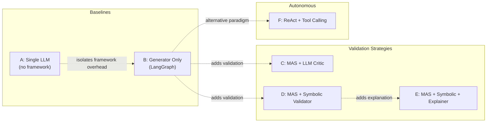
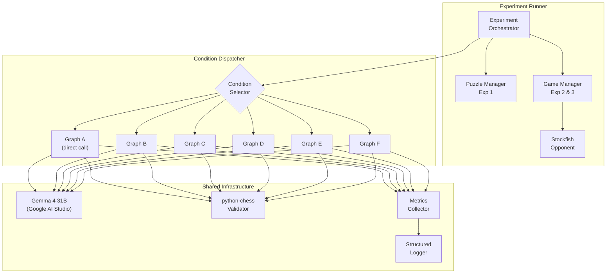
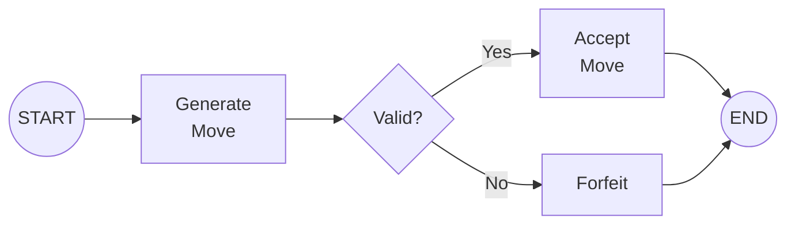
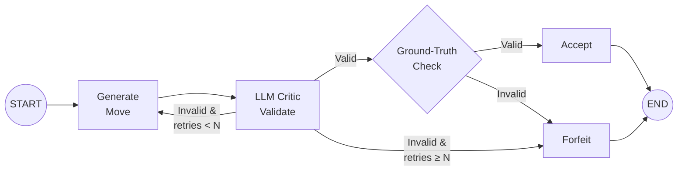
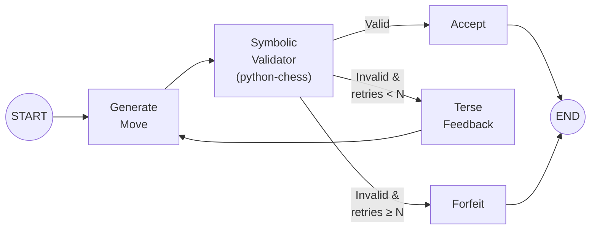
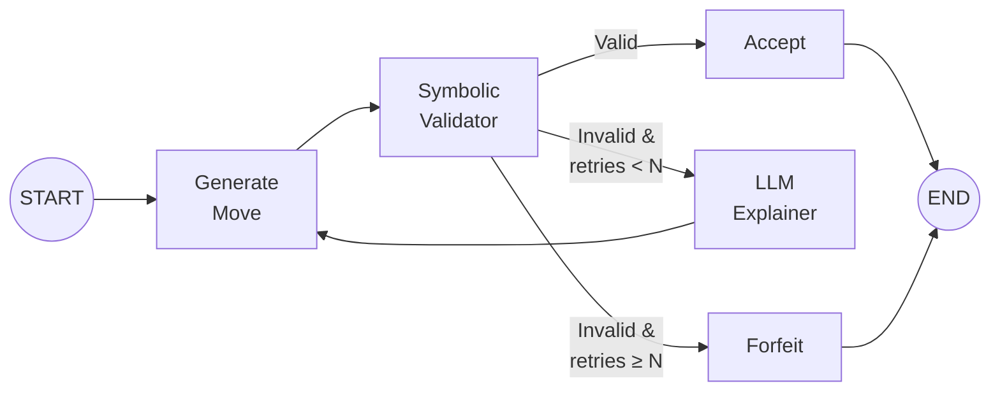
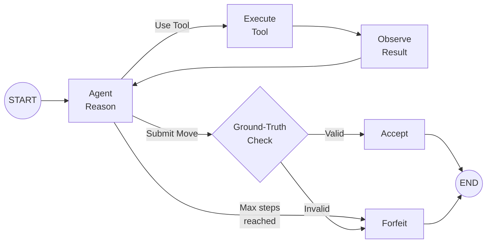
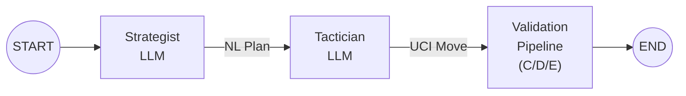
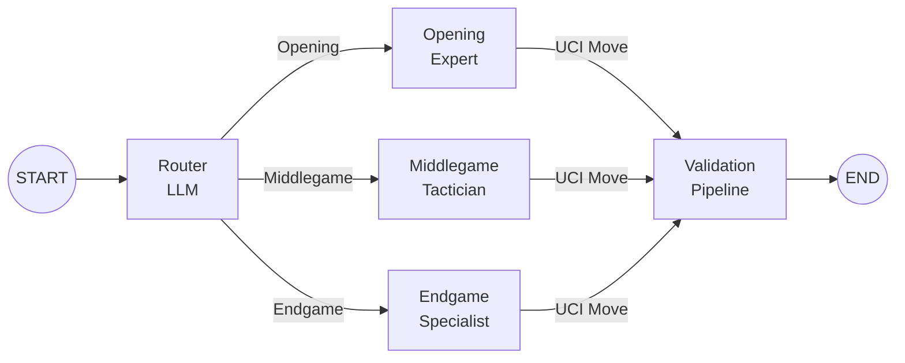

# Maat — Research Plan & System Architecture

## 1. Research Objectives

This project investigates whether explicit architectural structure — role separation, structured validation, and rule enforcement — can reduce rule violations and improve multi-turn consistency in LLM-based chess play.

### Research Questions

| ID | Question | Primary Metrics | Experiments |
|----|----------|-----------------|-------------|
| **RQ1** | Can explicit role separation reduce rule violations? | FIR, MFIR, ARR, Phase-Stratified FIR, IMFR, FST | Exp 1 (all conditions), Exp 2 & 3 (selected conditions) |
| **RQ2** | Does structured validation improve multi-turn consistency? Does embedding full board state (FEN) vs. move-history-only affect error recurrence? | SERR, PCRR, TTR, Legality Degradation Curve, FIR Cross-Experiment Δ, ECC, Input Length vs Error, Error-Type over Quartiles | Exp 2 vs Exp 3 |
| **RQ3** | How should rule enforcement be embedded inside an agentic workflow? | FIR, RSR, MRTC, LCPT, TPT, CAFIR, Critic Accuracy, Error-Type × Condition RSR | Exp 1 (all conditions) |

### Fixed Variables

| Variable | Value |
|----------|-------|
| LLM | Gemma 4 31B via Google AI Studio API |
| Framework | LangGraph (Python) |
| Rule Engine | `python-chess` |
| Move Format | UCI (e.g. `e2e4`, `e7e8q`) |
| Board Format | FEN |
| Opponent (full games) | Stockfish at ELO 800–1000 |

---

## 2. Experimental Conditions

### 2.1 Condition Overview



### 2.2 Condition Details

#### Condition A — Single LLM Baseline

- **Architecture**: Direct API call, no LangGraph.
- **Flow**: Prompt → LLM → parse UCI → validate with `python-chess` → if illegal, **forfeit**.
- **Purpose**: Establishes the raw LLM capability floor.

#### Condition B — Generator Only (LangGraph)

- **Architecture**: Single-node LangGraph graph wrapping the same LLM call.
- **Flow**: Identical logic to A, but inside LangGraph. If illegal, **forfeit**.
- **Purpose**: Isolates any effect of the framework itself (prompt templating, state management) from the agentic architecture. Serves as the true controlled baseline for conditions C–F.

#### Condition C — MAS + LLM Critic

- **Architecture**: Two-agent LangGraph graph (Generator + Critic).
- **Flow**: Generator proposes a move → Critic (same LLM, different system prompt) evaluates legality → if valid, accept; if invalid, Critic sends **detailed natural-language feedback** → Generator retries → repeat up to **N** times → **forfeit**.
- **Critic Prompt Design**: The Critic receives the FEN and the proposed move. It must reason about piece placement, legal destinations, and special rules (castling, en passant, pins). It returns a structured verdict: `{valid: bool, reasoning: str, suggestion: str}`.
- **Purpose**: Tests whether a second LLM pass (without ground-truth access) can catch errors.

#### Condition D — MAS + Symbolic Validator

- **Architecture**: Generator + `python-chess` validator node.
- **Flow**: Generator proposes a move → `python-chess` checks legality → if valid, accept; if invalid, return a **terse machine-generated error** (e.g., `"Illegal move e2e5: pawn on e2 cannot reach e5"`) → Generator retries → up to **N** times → **forfeit**.
- **Purpose**: Tests the impact of ground-truth rule enforcement with minimal feedback.

#### Condition E — MAS + Symbolic Validator + LLM Explainer

- **Architecture**: Generator + `python-chess` validator + Explainer agent.
- **Flow**: Generator proposes → validator checks → if invalid, Explainer (same LLM, explainer prompt) translates the symbolic error into **rich pedagogical feedback** (e.g., *"Your bishop on c1 is blocked by the pawn on d2. Bishops move diagonally and cannot jump over pieces. Consider moving the d2 pawn first."*) → Generator retries → up to **N** times → **forfeit**.
- **Purpose**: Tests whether combining ground-truth detection with LLM-generated explanation outperforms either alone.

#### Condition F — ReAct + Tool Calling

- **Architecture**: Multi-agent ReAct loop in LangGraph. The orchestrator agent reasons, selects actions (tool calls or final move submission), observes results, and iterates.
- **Available Tools** (all optional — the agent decides whether to call them):

Always available (all experiments):

| Tool | Signature | Description |
|------|-----------|-------------|
| `validate_move` | `(fen, move_uci) → {legal, reason, rule_ref}` | Only rule-enforcement tool |
| `is_in_check` | `(fen) → {in_check, checking_squares}` | Check status without board reveal |
| `get_game_phase` | `(move_history) → {opening/middlegame/endgame}` | Phase inference from ply count |
| `get_move_history_pgn` | `(move_history) → str` | Converts UCI history to PGN text |

Additional tools for Experiments 1 and 2 only (`fen` mode):

| Tool | Signature | Description |
|------|-----------|-------------|
| `get_board_visual` | `(fen) → str` | ASCII 8x8 board |
| `get_piece_at` | `(fen, square) → str` | Piece lookup (`wN`, `bQ`, `empty`) |
| `get_attackers` | `(fen, square) → list[dict]` | Attackers of a target square |
| `get_defenders` | `(fen, square) → list[dict]` | Defenders of square occupant |
| `is_square_safe` | `(fen, square, color) → {safe, threats}` | Destination safety helper |
| `get_position_after_moves` | `(fen, moves) → str` | Forward simulation returning FEN |

- **Flow**: Agent thinks → optionally calls tools → submits final move → ground-truth validation → if illegal, **forfeit**. Maximum **M** reasoning steps to prevent infinite loops.
- **Key Covariate**: Log every tool call (which tool, when, result) for stratified analysis.
- **Purpose**: Tests autonomous rule-seeking behaviour — does the LLM learn to validate before committing?

### 2.3 Retry & Termination Policy

| Parameter | Value | Rationale |
|-----------|-------|-----------|
| Max retries (N) for C, D, E | **3** | Balances giving correction opportunity vs. fair comparison; common in prior work |
| Max reasoning steps (M) for F | **6** | Prevents runaway loops; allows think → tool → think → tool → think → submit |
| Termination on final invalid | **Forfeit** (all conditions) | Uniform treatment; game counts as loss |

---

## 3. System Architecture

### 3.1 High-Level Architecture



### 3.2 Shared LangGraph State Schema

All LangGraph conditions (B–F) share a common state schema. This ensures consistent metric collection and enables apples-to-apples comparison.

```python
from typing import TypedDict, Literal
from langgraph.graph import MessagesState

class TurnState(TypedDict):
    # ── Position ──
    board_fen: str                          # Current FEN
    move_history: list[str]                 # All UCI moves so far
    move_number: int                        # Current full-move number

    # ── Input Mode ──
    input_mode: Literal["fen", "history"]   # Exp 2 vs Exp 3

    # ── Current Turn ──
    proposed_move: str                      # LLM's proposed UCI move
    is_valid: bool                          # Ground-truth validity
    retry_count: int                        # Attempts this turn
    max_retries: int                        # N (3 for C/D/E, 0 for A/B)
    feedback_history: list[str]             # Feedback messages this turn

    # ── Messages ──
    messages: list                          # LangGraph message list

    # ── Turn Metrics ──
    first_try_valid: bool                   # Was the very first attempt legal?
    error_types: list[str]                  # Error classifications this turn
    tool_calls: list[dict]                  # Tool call log (Condition F)
    total_attempts: int                     # Total attempts this turn
    llm_calls_this_turn: int               # LLM API calls this turn (for LCPT)
    tokens_this_turn: int                  # Total tokens (in+out) this turn (for TPT)
    prompt_token_count: int                # Input prompt tokens this turn (for RQ2b)
    wall_clock_ms: float                   # Wall-clock time for this turn (for Latency Per Turn)
    game_phase: str                        # Opening / Middlegame / Endgame (for Phase-Stratified FIR)

    # ── Critic-Specific (Condition C) ──
    critic_verdict: bool | None            # Critic's validity judgment (None if N/A)
    ground_truth_verdict: bool | None      # python-chess ground truth

    # ── Game-Level (accumulated) ──
    game_id: str
    condition: str
    turn_results: list[dict]               # Accumulated per-turn metric records
    game_status: Literal[
        "ongoing", "checkmate", "stalemate",
        "draw", "forfeit", "max_moves"
    ]
```

### 3.3 LangGraph Graph Topologies

#### Condition B — Generator Only



#### Condition C — LLM Critic Loop



> [!IMPORTANT]
> For Condition C, the Critic is an LLM — it can be wrong. A **ground-truth check** after the Critic approves is essential. If the Critic says "valid" but `python-chess` disagrees, the move is still recorded as invalid (but the game does NOT get a retry — the Critic already passed it). This captures the Critic's false-positive rate as a secondary metric.

#### Condition D — Symbolic Validator Loop



#### Condition E — Symbolic + Explainer Loop



#### Condition F — ReAct + Tools



### 3.4 Agent Prompt Architecture

All agents share a **base context block** injected at each turn:

```
You are playing chess as {color}.

{board_representation}

Move history (UCI): {move_history}
```

Where `{board_representation}` depends on the experiment:
- **Exp 1 & 2**: Full FEN + ASCII board diagram
- **Exp 3**: Move history only (FEN withheld)

Agent-specific system prompts:

| Agent | Key Instructions |
|-------|-----------------|
| **Generator** | "Output exactly one move in UCI format. Respond with ONLY the UCI move, no explanation." |
| **Critic** (C) | "You are a chess rules expert. Given the board position (FEN) and a proposed move (UCI), determine if the move is legal. Respond with JSON: `{valid, reasoning, suggestion}`." |
| **Explainer** (E) | "A chess move was rejected by the rule engine. Translate the following error into a clear, pedagogical explanation that helps the player understand why the move is illegal and what alternatives exist." |
| **ReAct Agent** (F) | "You are a chess player with access to analysis tools. Generate candidates yourself, optionally validate, and call `submit_move(uci)` to play. In history mode, board-revealing tools are unavailable." |

> [!NOTE]
> The Generator prompt deliberately asks for **only** the UCI move to minimize parsing complexity. A regex extractor `r'[a-h][1-8][a-h][1-8][qrbn]?'` serves as a fallback parser.

### 3.5 MAS Extensions (If Time Permits)

These extensions modify the **generation** stage of conditions B–E. The validation pipeline remains unchanged.

#### Extension 1: Planner-Actor



- **Strategist**: Receives the board state. Outputs a natural-language strategic plan (e.g., *"Develop the knight to f3 to control the center and prepare kingside castling"*).
- **Tactician**: Receives the plan + board state. Selects the best UCI move implementing the strategy.

#### Extension 2: Phase-Based Router



- **Router**: Classifies game phase from FEN + move count. Can use heuristic rules (move count thresholds, piece count) or LLM judgment.
- **Specialists**: Each has a phase-specific system prompt emphasizing relevant principles.

> [!WARNING]
> Extensions double or triple LLM calls per turn. Budget API costs carefully. With Gemma 4 31B on AI Studio, check rate limits and quotas before committing to extensions.

---

## 4. Experiments

### 4.1 Experiment 1 — Isolated Position Evaluation

| Parameter | Value |
|-----------|-------|
| **Objective** | Measure single-move legality across all conditions |
| **Answers** | RQ1, RQ3 |
| **Data Source** | Lichess puzzle database |
| **Sample Size** | 300 positions |
| **Stratification** | 100 opening × 100 middlegame × 100 endgame |
| **Difficulty** | Equally distributed across Lichess rating buckets within each phase |
| **Board Input** | Full FEN + ASCII board |
| **Task** | Play any legal move (not necessarily the puzzle solution) |
| **Conditions** | A, B, C, D, E, F |
| **Runs** | 1 pass per position per condition = 1,800 total evaluations |

**Puzzle Sampling Strategy**:
1. Download the [Lichess puzzle CSV](https://database.lichess.org/#puzzles)
2. Classify phase by move number and material count:
   - **Opening**: move ≤ 15
   - **Middlegame**: 15 < move ≤ 35 AND total material > endgame threshold
   - **Endgame**: move > 35 OR total material ≤ endgame threshold (≤ 13 non-pawn material points)
3. Within each phase, stratified random sample across Lichess rating quartiles
4. Each position is presented as: the FEN from the puzzle (after the opponent's last move)

### 4.2 Experiment 2 — Full Games with Board State

| Parameter | Value |
|-----------|-------|
| **Objective** | Measure multi-turn legality and consistency with full observability |
| **Answers** | RQ1, RQ3 (multi-turn), baseline for RQ2 |
| **Opponent** | Stockfish at ELO 800–1000 |
| **Sample Size** | 50 games per condition |
| **Board Input** | Full FEN + ASCII board sent **every turn** |
| **Max Moves** | 150 half-moves (75 full moves), then adjudicate as draw |
| **Conditions** | A, B, best-performing from Exp 1 |
| **Total Games** | 150 (3 conditions × 50) |

### 4.3 Experiment 3 — Full Games with Move History Only

| Parameter | Value |
|-----------|-------|
| **Objective** | Measure impact of board representation on consistency |
| **Answers** | RQ2 |
| **Opponent** | Stockfish at ELO 800–1000 (same settings as Exp 2) |
| **Sample Size** | 50 games per condition |
| **Board Input** | Move history only (FEN withheld) |
| **Conditions** | Same 3 conditions as Exp 2 |
| **Total Games** | 150 (3 conditions × 50) |

**Controlled Variables for Exp 2 vs 3**:
- Same Stockfish level
- Same opening positions (use a set of 50 fixed starting positions, reused across conditions and experiments)
- Same LLM, same temperature, same prompts (modulo board representation)

> [!IMPORTANT]
> **Reproducibility**: Set a fixed random seed for Stockfish and use deterministic sampling for puzzles. Save all FENs, prompts, and raw LLM outputs for post-hoc analysis.

---

## 5. Evaluation Framework

### 5.1 Error Taxonomy

Every illegal move is classified into exactly one error type. This taxonomy is referenced by all metrics involving error categorization (RSR heatmaps, recurrence analysis, quartile distributions).

| Error Type | Description | Detection |
|------------|-------------|-----------|
| `INVALID_PIECE` | No piece on source square, or wrong color | `python-chess` |
| `ILLEGAL_DESTINATION` | Piece cannot reach target square | `python-chess` |
| `LEAVES_IN_CHECK` | Move leaves own king in check | `python-chess` |
| `CASTLING_VIOLATION` | Illegal castling (through check, rights lost) | `python-chess` |
| `EN_PASSANT_VIOLATION` | Invalid en passant attempt | `python-chess` |
| `PROMOTION_ERROR` | Pawn reaches 8th rank without specifying promotion, or non-pawn promotes | `python-chess` |
| `PARSE_ERROR` | Output cannot be parsed as UCI | Regex parser |
| `NO_OUTPUT` | LLM returned empty or irrelevant text | Parser |

### 5.2 Experiment 1 Metrics — Isolated Positions

Each data point is a single puzzle position evaluated once per condition. N=300 positions × 6 conditions = 1,800 evaluations. All metrics are computed from this data.

| Metric | Definition | Formula | Conditions |
|--------|------------|---------|------------|
| **Final Invalid Rate (FIR)** | Fraction of positions ending in forfeit after all retries | `forfeits / total_positions` | All |
| **First-Try Invalid Rate (FTIR)** | Fraction of positions where the first attempt was illegal | `first_try_invalid / total_positions` | All |
| **Marginal FIR Reduction (MFIR)** | Percentage reduction in FIR when adding a role | `(FIR_X − FIR_Y) / FIR_X` for paired conditions X→Y | Paired |
| **Absolute Risk Reduction (ARR)** | Absolute drop in FIR between conditions | `FIR_X − FIR_Y` for paired conditions X→Y | Paired |
| **Phase-Stratified FIR** | FIR computed within Opening / Middlegame / Endgame | FIR per phase bucket | All |
| **Parse Failure Counts** | Raw count of `PARSE_ERROR` + `NO_OUTPUT` | Count | All |
| **Retry Success Rate (RSR)** | Of initially-invalid moves, fraction corrected within N retries | `corrected / initially_invalid` | C, D, E |
| **Mean Retries to Correct (MRTC)** | Average retries when correction succeeds | `sum(retries_for_corrected) / count(corrected)` | C, D, E |
| **LLM Calls Per Turn (LCPT)** | Total API calls per position | Count per position | All |
| **Tokens Per Turn (TPT)** | Total tokens (input + output) per position | Count per position | All |
| **Cost-Adjusted FIR (CAFIR)** | FIR penalized by compute cost | `FIR × LCPT` | C, D, E, F |
| **Critic Accuracy (TPR, FPR, TNR, FNR)** | Confusion matrix vs. `python-chess` ground truth | Standard rates | C only |
| **Error-Type × Condition RSR** | RSR per error type per condition (heatmap) | RSR within each error category | C, D, E |
| **Validation Tool Adoption (VTA)** | Fraction of turns using `validate_move` before submission | `validate_turns / total_turns` | F only |
| **Tool Call Rate (TCR)** | Fraction of turns with any tool call | `tool_turns / total_turns` | F only |
| **Tool-Call Distribution** | Frequency breakdown per tool type | Histogram | F only |
| **Tool-Stratified FIR** | FIR split by whether tools were used | FIR per tool-usage group | F only |
| **Avg. Reasoning Steps** | Mean think/act cycles per turn | `total_steps / total_turns` | F only |

> [!NOTE]
> **MFIR edge case**: If the baseline condition has FIR = 0, MFIR is undefined (division by zero). In this case, ARR must be reported exclusively. Both MFIR and ARR are tested via the existing McNemar pairs.

MFIR is computed for each chained pair to show the marginal value of each architectural role:

| Pair | What It Isolates |
|------|------------------|
| A → B | Framework overhead (should be ≈ 0) |
| B → C | Adding a Critic role |
| B → D | Adding a Symbolic Validator role |
| D → E | Adding an Explainer role on top of Validator |
| B → F | Adding autonomous tool access |

Expected LCPT by condition:

| Condition | Min LCPT | Max LCPT | Notes |
|-----------|----------|----------|-------|
| A | 1 | 1 | Single call, no retries |
| B | 1 | 1 | Single call, no retries |
| C | 2 | 2 + 2N | Generator + Critic per attempt |
| D | 1 | 1 + N | Generator only; validator is symbolic (free) |
| E | 1 | 1 + 2N | Generator + Explainer per failed attempt |
| F | 1 | M | 1 to M reasoning steps, each may call LLM |

> [!IMPORTANT]
> **CAFIR exclusion**: Conditions A and B are strictly excluded from CAFIR ranking because their LCPT is architecturally locked at 1. They cannot trade cost for quality and are reported separately as fixed baselines.

> [!IMPORTANT]
> **Critic FNR**: The Critic False Negative Rate measures how often the Critic *approves* an illegal move. Since the ground-truth check after Critic approval causes a forfeit (not a retry), a high FNR means the Critic is a liability — it provides false confidence.

### 5.3 Experiments 2 & 3 Metrics — Full Games

Each data point is a full game against Stockfish (N=50 games × 3 conditions × 2 experiments = 300 games). Experiment 2 provides the full FEN every turn; Experiment 3 provides move history only.

| Metric | Definition | Formula | Conditions |
|--------|------------|---------|------------|
| **Final Invalid Rate (FIR)** | Fraction of turns ending in forfeit | `forfeits / total_turns` | All |
| **First-Try Invalid Rate (FTIR)** | Fraction of turns where first attempt was illegal | `first_try_invalid / total_turns` | All |
| **Illegal-Move Forfeit Rate (IMFR)** | Fraction of games lost specifically to a rule violation | `forfeit_games / total_games` | All |
| **Forfeit Survival Time (FST)** | Half-moves played before a rule-violation forfeit | Kaplan-Meier estimand | All |
| **Same-Error Recurrence Rate (SERR)** | Fraction of error types that occur more than once in a game | Per-game rate | All |
| **Post-Correction Recurrence (PCRR)** | Frequency of repeating the same error type after correction | Per-game rate | Retry only ¹ |
| **Turns-to-Recovery (TTR)** | Clean moves following a corrected error | Count per correction event | Retry only ¹ |
| **Legality Degradation Curve** | FTIR plotted in 10-move bins over game progress | Visual + regression | All |
| **FIR Cross-Experiment Δ** | Per-condition FIR difference between Exp 2 and Exp 3 | Paired by starting position | All |
| **Error Clustering Coefficient (ECC)** | Ratio of observed consecutive error pairs to expected pairs | Per-game ratio | All |
| **Input Length vs. Error Correlation** | Spearman's ρ between prompt token count and error occurrence | Partial correlation | All |
| **Error-Type Dist. over Quartiles** | Error taxonomy frequency by turn quartile (Q1–Q4) | Chi-squared table | All |
| **Parse Failure Counts** | Raw count of `PARSE_ERROR` + `NO_OUTPUT` | Count | All |
| **LLM Calls Per Turn (LCPT)** | Average API calls per turn | `total_llm_calls / total_turns` | All |
| **Tokens Per Turn (TPT)** | Average tokens (input + output) per turn | `total_tokens / total_turns` | All |

> ¹ PCRR and TTR are only computable for conditions with a retry mechanism. Conditions A and B forfeit on first illegal move — there is no correction event and therefore no recovery to measure. These metrics are reported as N/A for A and B.

**ECC operationalization**:

```
ECC = (observed pairs of errors in consecutive turns) /
      (Σ FTIR(t) × FTIR(t+1)  for t = 1 … total_turns − 1)
```

A flat Bernoulli baseline (i.e. `(total_turns − 1) × FTIR²`) is explicitly rejected here because the Legality Degradation Curve shows that error probability increases with move number. Using a single global FTIR would underestimate expected late-game error pairs and artificially inflate ECC in the endgame. The time-varying formulation computes expected pairs turn-by-turn using the empirical FTIR at each position.

> [!IMPORTANT]
> **FTIR(t) definition**: `FTIR(t)` is the empirical first-try error rate at turn `t` **pooled across all games in that condition** — not a per-game quantity. Within a single game, each turn is binary (error or not), so a per-game FTIR(t) would be 0 or 1, which is meaningless as a probability baseline. Each game's observed pairs are divided by the population-level expected pairs, yielding a per-game ECC ratio suitable for bootstrapping.

- ECC > 1 → errors cluster (one error makes the next more likely)
- ECC ≈ 1 → errors are independent
- ECC < 1 → errors anti-cluster (correction effect — error makes next turn *less* likely to error)

**Key rationales**:

- **FST**: Replaces the prior Moves Before Forfeit (MBF) metric with a proper survival-analysis estimand. Games reaching natural termination (checkmate/draw) **and** games hitting the 150 half-move limit are right-censored at their final move, not excluded.
- **Input Length vs. Error**: In Exp 3 (history-only), the prompt grows every turn. A strong positive ρ in Exp 3 but not Exp 2 (fixed-size FEN) indicates context-window degradation — not game complexity — drives inconsistency.
- **Error-Type over Quartiles**: The Legality Degradation Curve shows aggregate trends but not *which* error types drive degradation. This metric breaks down the taxonomy by game progress quartile (Q1: turns 1–25%, Q2: 25–50%, Q3: 50–75%, Q4: 75–100%).

> [!NOTE]
> **Scope limitation**: Experiments 2 & 3 run only A, B, and the best condition from Exp 1. Metrics requiring retry mechanisms (PCRR, TTR, RSR, CAFIR) or tool-calling (TCR, VTA, Tool-Stratified FIR) are only computed if the best-performing condition includes those mechanisms.

---

## 6. Research Question Analysis

### 6.1 RQ1: Can explicit role separation reduce rule violations?

**Core question**: Does adding distinct agent roles (Critic, Validator, Explainer, ReAct tools) to the generation pipeline reduce the rate of illegal moves?

#### 6.1.1 Metrics

| Metric | Role | Source | What It Reveals |
|--------|------|--------|-----------------|
| FIR | Primary | Exp 1 | Main comparison axis — ultimate failure rate after all retries across all 6 conditions |
| MFIR & ARR | Primary | Exp 1 | Marginal contribution of each added role (quantifies the value of upgrading A→B→C/D→E, B→F) |
| Phase-Stratified FIR | Primary | Exp 1 | Whether architecture effectiveness depends on game phase (opening vs. middlegame vs. endgame) |
| FTIR | Primary | Exp 1 | Relevant when MAS extensions (Planner-Actor, Router-Specialists) change the generation stage, making first-try rates differ across conditions |
| IMFR | Primary | Exp 2, 3 | Game-level: fraction of games lost specifically to a rule violation |
| FST | Primary | Exp 2, 3 | Game-level: how long the agent survives before a fatal illegal move |

> [!NOTE]
> **Why FTIR has limited RQ1 value in the base experiment**: For base conditions B–E (same generator LLM and prompt), FTIR measures the generator's first attempt *before* any validation occurs — it will be near-identical. The role-separation effect manifests in FIR (after the retry loop). However, Condition A always uses a plain generator, and with MAS extensions the generation stage can use (Strategist → Tactician) or (Router → Specialists), making FTIR a meaningful RQ1 differentiator in those comparisons.

#### 6.1.2 Statistical Tests

| Test | Target Metric | Question Answered | Execution Details |
|------|--------------|-------------------|-------------------|
| **Cochran's Q** + **McNemar's** (post-hoc) | FIR (all conditions) | Do the architectures perform differently? Which specifically beats another? | N=300 matched pairs across all conditions. Parse failures count as forfeits, not missing data. McNemar with Bonferroni correction for confirmatory significance; Benjamini-Hochberg (FDR) flags exploratory signals. ARR is directly derived from these McNemar pairs. |
| **95% Bootstrapped CI** | MFIR & ARR | What is the exact magnitude of upgrading the architecture? | Handles the ratio instability of MFIR. If FIR_baseline = 0, MFIR is undefined and ARR must be reported exclusively. |
| **Logistic Regression** | Phase-Stratified FIR | Does architecture effectiveness depend on game phase? | Primary estimand: interaction term in `P(illegal) ~ condition + phase + condition × phase`. |
| **Fisher's Exact Test** | IMFR | Do complex architectures reduce games lost to illegal moves? | Two-sided. Run pairwise across 3 conditions in Exp 2/3 (3 pairs per experiment) with Bonferroni correction. Required over Chi-squared because N=50 games makes expected cell counts < 5 highly likely. |
| **Log-Rank Test** | FST (Kaplan-Meier) | Does the architecture significantly extend the agent's lifespan before a fatal error? | Games reaching natural termination (checkmate/draw) and games hitting the 150 half-move cap are strictly right-censored at their final move, not excluded. |

### 6.2 RQ2: Does structured validation improve multi-turn consistency?

**Core question**: Does the agent maintain legality over the course of a full game? Does board representation (FEN vs. history-only) affect error patterns, recurrence, and degradation?

> [!IMPORTANT]
> **FDR Correction**: RQ2 runs ≈12 overlapping inferential tests on the same datasets. A Benjamini-Hochberg False Discovery Rate correction (q < 0.05) must be applied across all p-values before interpreting significance. Breakdown: 3 (FIR Δ per condition) + 2 (SERR & PCRR paired) + 1 (Legality Degradation key coefficient) + 1 (Input Length Fisher z) + 2 (Kruskal-Wallis SERR & PCRR) + 1 (TTR) + 2 (Error-Type Quartiles per experiment) = 12. Confirm exact count during pre-analysis protocol finalization.

#### 6.2.1 Metrics

| Metric | Role | Comparison Axis |
|--------|------|-----------------|
| FIR Cross-Experiment Δ | Primary | Exp 2 vs 3 per condition — most direct test of FEN vs. history-only |
| SERR | Primary | Cross-condition + Exp 2 vs 3 |
| PCRR | Primary | Cross-condition + Exp 2 vs 3 (retry conditions only) |
| TTR | Primary | Exp 2 vs 3 (retry conditions only) |
| Legality Degradation Curve | Primary | Cross-condition + Exp 2 vs 3 — does failure rate spike over time? |
| ECC | Secondary | Cross-condition + Exp 2 vs 3 — do errors trigger cascading failure loops? |
| Input Length vs. Error | Secondary | Exp 2 vs 3 — isolates context-window fatigue from positional complexity |
| Error-Type Dist. over Quartiles | Secondary | Cross-condition + Exp 2 vs 3 — which error types drive degradation? |
| FTIR (per-game, over time) | Supporting | Cross-condition — time-series of raw error rate |

#### 6.2.2 Statistical Tests

| Test | Target Metric | Question Answered | Execution Details |
|------|--------------|-------------------|-------------------|
| **Wilcoxon Signed-Rank** | FIR Cross-Experiment Δ | Does seeing the full board (FEN) reduce per-turn error rates compared to history-only? | Paired by starting position, computed per condition. Per-game FIR values are the paired observations. |
| **Wilcoxon Signed-Rank** | SERR & PCRR (Exp 2 vs 3) | Does FEN prevent repeating mistakes better than move history? | Paired by starting position. Assumes uniform application of the error taxonomy. |
| **Mixed-Effects Logistic Regression** | Legality Degradation | Does the agent's failure rate spike as the game progresses? | Must include random intercept per game `(1|game_id)` for intra-game correlation. |
| **Partial Spearman's ρ** | Input Length vs. Error | Is the LLM failing due to prompt length or positional complexity? | Partial out `move_number` to isolate token count. Compare Exp 2 vs Exp 3 ρ values via Fisher z-transformation. |
| **Bootstrap 95% CI** | ECC | Do errors cause cascading failure loops (avalanches)? | Time-varying baseline `FTIR(t) × FTIR(t+1)`. Aggregation: sum(observed)/sum(expected) per game. CI on game-level ECC values. |
| **Kruskal-Wallis** | SERR & PCRR | Which architecture best prevents hallucination loops? | Across 3 conditions within Experiment 2. Low power with k=3 at N=50 acknowledged; report effect sizes alongside p-values. |
| **Mann-Whitney U** or **Kaplan-Meier** | TTR | Which architecture returns to clean play fastest after a mistake? | Retry conditions only. Default: Mann-Whitney U. If censoring is substantial (>20% of corrections result in clean play until game end), switch to Kaplan-Meier survival curves. |
| **Chi-Squared of Homogeneity** | Error-Type over Quartiles | Does the *type* of mistake change as the agent gets fatigued? | Pre-analysis rule: error types with expected cell frequency < 5 must be collapsed into an "Other" category. |

### 6.3 RQ3: How should rule enforcement be embedded?

**Core question**: Comparing enforcement strategies — LLM Critic (C) vs. Symbolic Validator (D) vs. Symbolic+Explainer (E) vs. ReAct+Tools (F) — which provides the best reliability, at what cost, and with what failure modes?

#### 6.3.1 Metrics

**Effectiveness**:

| Metric | Role | Conditions | What It Reveals |
|--------|------|------------|-----------------|
| FIR | Primary | All | Ultimate failure rate — which strategy lets the fewest errors through? |
| Phase-Stratified FIR | Primary | All | Does enforcement effectiveness vary by game phase? |
| RSR | Primary | C, D, E | Of initially-invalid moves, what fraction gets corrected? |
| MRTC | Primary | C, D, E | How many retries does correction take on average? |

**Cost & Efficiency**:

| Metric | Role | Conditions | What It Reveals |
|--------|------|------------|-----------------|
| LCPT | Primary | All | API cost per move — how expensive is each strategy? |
| TPT | Primary | All | Token consumption — compute footprint |
| CAFIR | Secondary | C, D, E, F | ROI metric — is the cost worth the error reduction? A,B excluded (LCPT=1). |
| Parse Failure Counts | Diagnostic | All | Raw formatting failures (`PARSE_ERROR` + `NO_OUTPUT`) — logged across all experiments |

**Critic Accuracy** (Condition C only):

| Metric | Definition |
|--------|------------|
| TPR | P(Critic says invalid ∣ move is actually invalid) |
| FPR | P(Critic says invalid ∣ move is actually valid) |
| TNR | P(Critic says valid ∣ move is actually valid) |
| FNR | P(Critic says valid ∣ move is actually invalid) |

Ground-truth classifications determined strictly by `python-chess`. The puzzle's tactical solution is irrelevant.

**Error-Type Recovery**: RSR per error type per condition (C, D, E), presented as a heatmap. Reveals which enforcement strategy excels at which error types. RSR heatmaps must be presented alongside base-rate frequency — high RSR for rare error types (small cell counts) must be flagged.

**Condition F Agent Behavior**:

| Metric | Definition |
|--------|------------|
| TCR | Fraction of turns where at least one tool was called |
| Tool-Call Distribution | Frequency breakdown per tool type |
| VTA | Fraction of turns where `validate_move` was called before submission |
| Tool-Stratified FIR | FIR split by whether tools were used |
| Avg. Reasoning Steps | Mean think/act cycles per turn |

#### 6.3.2 Statistical Tests

| Test | Target Metric | Question Answered | Execution Details |
|------|--------------|-------------------|-------------------|
| **Cochran's Q** + **McNemar's** (post-hoc) | FIR (C, D, E, F) | Which enforcement strategy is the ultimate winner for reliability? | Same constraints as RQ1: strict matched pairs, parse errors = forfeits. Bonferroni correction. |
| **Fisher's Exact Test** | RSR | Which strategy fixes the most errors? | Preferred over Chi-squared: 3 conditions (C, D, E) with potentially rare error types make expected cells < 5 likely. |
| **Chi-Squared of Proportions** | Parse Failure Counts | Which strategy formats output best? | Numerator combines `PARSE_ERROR` + `NO_OUTPUT`. |
| **Kruskal-Wallis** | MRTC, LCPT, TPT | Which strategy uses least compute and recovers fastest? | Required: API calls, tokens, and retry steps are non-normally distributed counts. |
| **Bootstrap Ranking (95% CI)** | CAFIR | Which strategy offers the best ROI factoring in API costs? | A & B strictly excluded from ranking (LCPT locked at 1). Reported separately as fixed baselines. |
| **Chi-Squared of Homogeneity** + **Fisher's Exact** | Error-Type × Condition RSR | Do architectures have blind spots for specific error types? | Fisher's Exact when expected cell counts < 5. High RSR for rare error types must be flagged. |
| **Wilson 95% CI** | TPR, FPR, TNR, FNR (Critic) | How trustworthy is the LLM Critic? | Wilson intervals handle small denominators correctly. |

#### 6.3.3 Condition F Stratified Analysis

| Analysis | Target | Purpose | Execution Details |
|----------|--------|---------|-------------------|
| Tool-use tercile split | Tool-Stratified FIR | Does tool use causally reduce errors? | Split by TCR terciles (low/med/high); compare FIR within each. |
| Logistic Regression | FIR ~ tool usage | Controlled test of tool effect | `P(illegal) ~ tool_used + position_difficulty + game_phase`. Report odds ratios with 95% CI. |
| Descriptive statistics | TCR, VTA, Tool-Call Dist., Avg. Reasoning Steps | Agent behavior profile | Medians with IQR. VTA as predictor of FIR. Tool-Call Distribution as frequency histogram per tool type. |

### 6.4 Complete RQ → Metric → Experiment Mapping

| Metric | RQ1 | RQ2 | RQ3 | Exp 1 | Exp 2 | Exp 3 |
|--------|-----|-----|-----|-------|-------|-------|
| FIR | ✅ Primary | | ✅ Primary | ✅ | ✅ | ✅ |
| FTIR | ✅ ¹ | ✅ Primary | | ✅ | ✅ | ✅ |
| MFIR | ✅ Primary | | | ✅ | | |
| ARR | ✅ Primary | | | ✅ | | |
| Phase-Stratified FIR | ✅ Primary | | ✅ | ✅ | | |
| IMFR | ✅ Primary | | | | ✅ | ✅ |
| FST | ✅ Primary | | | | ✅ | ✅ |
| SERR | | ✅ Primary | | | ✅ | ✅ |
| PCRR | | ✅ Primary | | | ✅ ² | ✅ ² |
| TTR | | ✅ Primary | | | ✅ ² | ✅ ² |
| Legality Degradation | | ✅ Primary | | | ✅ | ✅ |
| FIR Cross-Experiment Δ | | ✅ Primary | | | ✅ | ✅ |
| ECC | | ✅ Secondary | | | ✅ | ✅ |
| Input Length vs Error | | ✅ Secondary | | | ✅ | ✅ |
| Error-Type over Quartiles | | ✅ Secondary | | | ✅ | ✅ |
| FTIR (over time) | | ✅ Supporting | | | ✅ | ✅ |
| Parse Failure Counts | | | ✅ Diagnostic | ✅ | ✅ | ✅ |
| RSR | | | ✅ Primary | ✅ | ³ | ³ |
| MRTC | | | ✅ Primary | ✅ | ³ | ³ |
| LCPT | | | ✅ Primary | ✅ | ✅ | ✅ |
| TPT | | | ✅ Primary | ✅ | ✅ | ✅ |
| CAFIR | | | ✅ Secondary | ✅ | ³ | ³ |
| Critic Accuracy | | | ✅ Secondary | ✅ | | |
| Error-Type × Condition RSR | | | ✅ Secondary | ✅ | | |
| VTA (Cond. F) | | | ✅ F-specific | ✅ | ³ | ³ |
| TCR (Cond. F) | | | ✅ F-specific | ✅ | ³ | ³ |
| Tool-Call Distribution (F) | | | ✅ F-specific | ✅ | ³ | ³ |
| Tool-Stratified FIR (F) | | | ✅ F-specific | ✅ | ³ | ³ |
| Avg. Reasoning Steps (F) | | | ✅ F-specific | ✅ | ³ | ³ |

> ¹ FTIR becomes RQ1-relevant when MAS extensions (Planner-Actor, Router-Specialists) change the generation stage. For base conditions B–E (same generator), FTIR is expected to be near-identical across conditions.
>
> ² Only computable for conditions with retry mechanisms. Conditions A and B forfeit on first error.
>
> ³ Computed in Exp 2/3 only if the best-performing condition from Exp 1 includes the relevant mechanism (retries for RSR/MRTC/CAFIR; tool calling for TCR/VTA/Tool-Stratified FIR).

### 6.5 Effect Size & Power

- Report **odds ratios** with 95% CI for all rate-based metrics
- Report **Cohen's d** for continuous metrics (MRTC, LCPT, TPT)
- With N=300 per condition (Exp 1), a 10-percentage-point difference in FIR (e.g., 40% vs 30%) is detectable at α=0.05, power=0.80
- With N=50 games (Exp 2, 3), per-game IMFR differences of ~20 percentage points are detectable
- Bonferroni correction for all pairwise comparisons within RQ1 and RQ3
- Benjamini-Hochberg FDR correction (q < 0.05) for the RQ2 family of ≈12 tests

---

## 7. Project Structure

```
Maat/
├── src/
│   ├── agents/
│   │   ├── base.py               # Base agent class, prompt builder
│   │   ├── generator.py          # Move generator agent
│   │   ├── critic.py             # LLM critic (Condition C)
│   │   ├── explainer.py          # LLM explainer (Condition E)
│   │   ├── react_agent.py        # ReAct orchestrator (Condition F)
│   │   ├── strategist.py         # Planner (extension)
│   │   ├── tactician.py          # Actor (extension)
│   │   ├── router.py             # Phase router (extension)
│   │   └── specialists.py        # Phase-specific experts (extension)
│   ├── graphs/
│   │   ├── base_graph.py         # Shared graph utilities
│   │   ├── condition_a.py        # Direct LLM baseline (no LangGraph)
│   │   ├── condition_b.py        # Generator Only
│   │   ├── condition_c.py        # + LLM Critic
│   │   ├── condition_d.py        # + Symbolic Validator
│   │   ├── condition_e.py        # + Symbolic + Explainer
│   │   └── condition_f.py        # ReAct + Tools
│   ├── validators/
│   │   ├── symbolic.py           # python-chess validation + error classification
│   │   └── move_parser.py        # UCI output parser with fallback regex
│   ├── tools/
│   │   └── chess_tools.py        # Tool implementations for Condition F
│   ├── engine/
│   │   ├── game_manager.py       # Full-game orchestration (Exp 2 & 3)
│   │   ├── puzzle_manager.py     # Single-position evaluation (Exp 1)
│   │   └── stockfish_wrapper.py  # Stockfish interface
│   ├── metrics/
│   │   ├── collector.py          # Per-turn metric recording
│   │   ├── aggregator.py         # Game-level & condition-level aggregation
│   │   ├── recurrence.py         # SERR, PCRR computation
│   │   └── definitions.py        # Metric enums and schemas
│   ├── data/
│   │   ├── puzzle_sampler.py     # Lichess puzzle download & stratified sampling
│   │   └── opening_positions.py  # Fixed starting positions for Exp 2 & 3
│   ├── prompts/
│   │   ├── generator.txt         # Generator system prompt
│   │   ├── critic.txt            # Critic system prompt
│   │   ├── explainer.txt         # Explainer system prompt
│   │   └── react.txt             # ReAct agent system prompt
│   ├── state.py                  # TurnState TypedDict definition
│   └── config.py                 # Experiment configuration loader
├── experiments/
│   ├── run_experiment_1.py       # Exp 1 runner
│   ├── run_experiment_2.py       # Exp 2 runner
│   └── run_experiment_3.py       # Exp 3 runner
├── analysis/
│   ├── analyze_exp1.py           # Exp 1 statistical analysis
│   ├── analyze_exp2_3.py         # Exp 2 vs 3 comparison
│   ├── plot_results.py           # Visualization
│   └── tables.py                 # LaTeX table generation
├── configs/
│   ├── experiment_1.yaml
│   ├── experiment_2.yaml
│   └── experiment_3.yaml
├── results/                      # Output directory (gitignored)
│   ├── exp1/
│   ├── exp2/
│   └── exp3/
├── tests/
│   ├── test_validator.py
│   ├── test_parser.py
│   ├── test_graphs.py
│   └── test_metrics.py
├── requirements.txt
├── .env.example                  # API key template
└── README.md
```

---

## 8. Implementation Roadmap

### Phase 1 — Core Infrastructure (Week 1–2)

1. Set up project scaffolding, dependencies, linting
2. Implement `TurnState` schema and shared utilities
3. Implement `symbolic.py` validator + error classifier
4. Implement `move_parser.py` (UCI extraction with fallback regex)
5. Implement `chess_tools.py` (all 5 tools for Condition F)
6. Implement `puzzle_sampler.py` (download + stratified sampling from Lichess)
7. Implement `stockfish_wrapper.py`
8. Write unit tests for all of the above

### Phase 2 — Conditions & Graphs (Week 2–3)

1. Implement Condition A (direct LLM call, no LangGraph)
2. Implement Condition B (Generator Only graph)
3. Implement Condition C (Generator + Critic graph)
4. Implement Condition D (Generator + Symbolic validator graph)
5. Implement Condition E (Generator + Symbolic + Explainer graph)
6. Implement Condition F (ReAct + Tools graph)
7. End-to-end integration test: run each condition on 5 positions, verify metric collection

### Phase 3 — Experiment Infrastructure (Week 3–4)

1. Implement `metrics/collector.py` and `metrics/aggregator.py`
2. Implement `puzzle_manager.py` (Exp 1 orchestrator)
3. Implement `game_manager.py` (Exp 2 & 3 orchestrator)
4. Implement experiment YAML configs
5. Implement result serialization (JSON lines per turn, CSV summaries)
6. Dry-run: 10 positions × 6 conditions, verify all outputs and metrics

### Phase 4 — Run Experiments (Week 4–6)

1. **Experiment 1**: 300 positions × 6 conditions (1,800 evaluations)
2. Analyze Exp 1 results, identify best-performing condition
3. **Experiment 2**: 50 games × 3 conditions (150 games, full FEN)
4. **Experiment 3**: 50 games × 3 conditions (150 games, history only)

### Phase 5 — Analysis & Writing (Week 6–8)

1. Run statistical tests per analysis plan
2. Generate figures: FTIR bar charts, degradation curves, recurrence heatmaps
3. Write results and discussion sections
4. **(If time)**: Implement Planner-Actor extension, re-run best condition

---

## 9. Risk & Mitigation

| Risk | Impact | Mitigation |
|------|--------|------------|
| API rate limits on Google AI Studio | Slows experiments | Implement exponential backoff + checkpointing; resume from last completed position |
| Gemma 4 can't parse FEN at all | Very high FTIR, uninformative results | Add ASCII board to all FEN prompts; run a pilot with 20 positions first |
| Stockfish games too long | Exceeds token limits | Cap at 150 half-moves; use Stockfish ELO 800 for shorter games |
| Critic agent (C) has very high false-positive rate | Condition C looks worse than A | This IS a valid finding (LLM-only validation is unreliable) — report it |
| Gemma 4 refuses to play chess | Blocking | Pilot test; if needed, adjust system prompt or consider model switch |

---

## Verification Plan

### Automated Tests
- Unit tests for symbolic validator (all 8 error types)
- Unit tests for UCI parser (valid moves, invalid strings, edge cases like promotions)
- Integration test: each graph runs on 5 fixed FENs, produces expected state transitions
- Metric computation tests: mock data → verify FTIR, SERR, PCRR formulas

### Pilot Run
- Before full experiments: 20 positions × 6 conditions pilot
- Verify: prompts produce parseable output, metrics collect correctly, API throughput is sustainable
- Estimate total runtime and cost for full experiments

### Reproducibility
- All raw LLM outputs saved as JSONL
- Random seeds for puzzle sampling and Stockfish fixed and documented
- Full experiment configs committed to git
